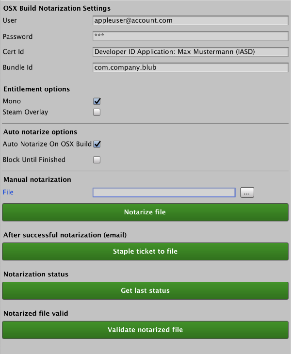

# Unity OSX Notarize

## What it does

Provides you with a simple in-editor interface to notarize osx apps, needed for macOS Catalina compatibility.

{:height="50%" width="50%"}

## How to use

### Setup
1. From the menu, click `Tools` > `Notarization...`
1. Fill in fields for user, password, certificate id and bundle id

### Automatic notarize
Enable auto notarization on each new OSX build by marking checkbox "Auto Notarize On OSX Build".
This will sign each new OSX built (BuildTarget: StandaloneOSX) automatically and send it to the Apple notarization service. 

Be aware, this will not automatically staple the resulting ticket to the build, this has to be done manually after receiving the success mail from Apple.

### Manual notarize
Manually notarize an app bundle by selecting it via the file picker, and clicking on "Notarize file" button. After that wait until success mail arrives from Apple.

### Manual staple
Manually staple a ticket to the app bundle by selecting it via file picker, and clicking on "Staple ticket to file" button. 
This has to be done after receiving the success mail from Apple notarization service.

### Notes

- You can comment out the `com.apple.security.cs.allow-unsigned-executable-memory` entitlement in the `script/entitlements.xml` if you are not using the Mono scripting backend

- All settings are persisted under `Assets/Editor/Notarization/NotarizationSettings.asset` except the password property this has to be filled in anew on each editor startup